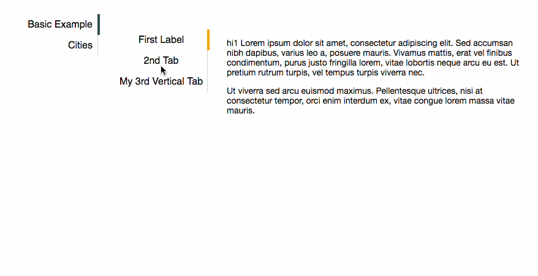

## Installation
Using [npm](https://www.npmjs.com/):
```bash
npm install --save react-vtabs
```
Using [yarn](https://yarnpkg.com/en/):
```bash
yarn add react-vtabs
```

## Usage

```js
import React, { Component } from 'react';
import { renderDOM } from 'react-dom';
import { VTabs, VTab } from 'react-vtabs';


class App extends Component {
  render() {
    return (
      <VTabs
		tabContainerStyle={{ marginLeft: 20 }}
		tabLabelStyle={{ width: 50 }}
		inkBarStyle={{ backgroundColor:"orange", width: 4 }}>
		<VTab label="t1">
			<div><p>hi1 Lorem ipsum dolor sit amet, consectetur adipiscing elit. Sed accumsan nibh dapibus, varius leo a, posuere mauris. Vivamus mattis, erat vel finibus condimentum, purus justo fringilla lorem, vitae lobortis neque arcu eu est. Ut pretium rutrum turpis, vel tempus turpis viverra nec.</p>
			<p>Ut viverra sed arcu euismod maximus. Pellentesque ultrices, nisi at consectetur tempor, orci enim interdum ex, vitae congue lorem massa vitae mauris.</p></div>
		</VTab>
		<VTab label="t2">
			<div>hi2 Vivamus mattis, erat vel finibus condimentum, purus justo fringilla lorem, vitae lobortis neque arcu eu est. Ut pretium rutrum turpis, vel tempus turpis viverra nec</div>
		</VTab>
		<VTab label="t3" tabContainerStyle={{ backgroundColor: 'rgba(255, 165, 0, 0.5)' }}>
			<div>
				<p>hi3 Nulla eget malesuada diam. Aliquam condimentum scelerisque odio, non consequat diam sodales fermentum. Vestibulum et congue leo. Duis tincidunt metus eu ullamcorper lacinia. Vestibulum ante ipsum primis in faucibus orci luctus et ultrices posuere cubilia Curae;</p>
				<p>Pellentesque condimentum placerat ipsum sit amet bibendum. Vestibulum mattis magna et interdum aliquam.</p>
			</div>
		</VTab>
	</VTabs>
    );
  }
}

renderDOM(
  <App/>,
  document.getElementById('react-root')
);
```

## Properties

* style -  root style, available on both VTabs and VTab

#### VTabs properties
* tabContainerStyle - optional style of the tab content container

* tabLabelStyle - optional style of the label section

* inkBarStyle - optional, the color, width, border, etc of the `selected` indicator

* value - optionally define the inital selected tab (zero based)

* onTabSelect - optionally define a function that will be invoked when a tab is clicked, returns an index

#### VTab properties
* label - is required

* tabContainerStyle - optional overridding style of this tab's content section

* tabLabelStyle - optional overridding style of this tab's label section

# Examples

* node_modules/react-vtabs/dist/index.html



